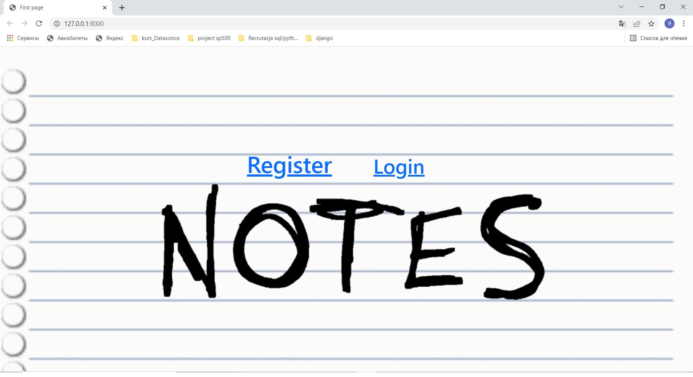
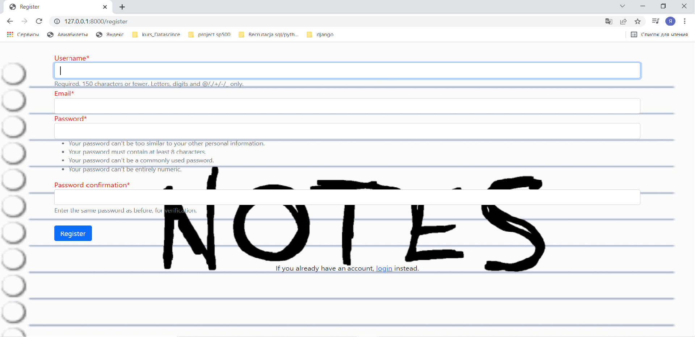
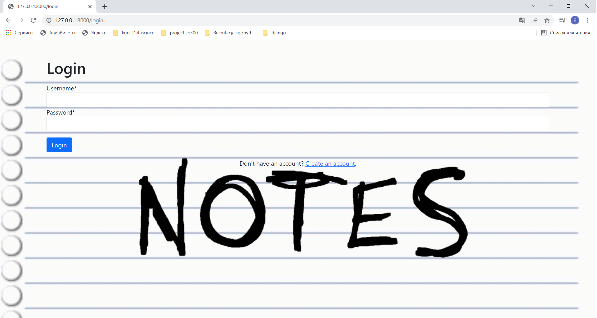
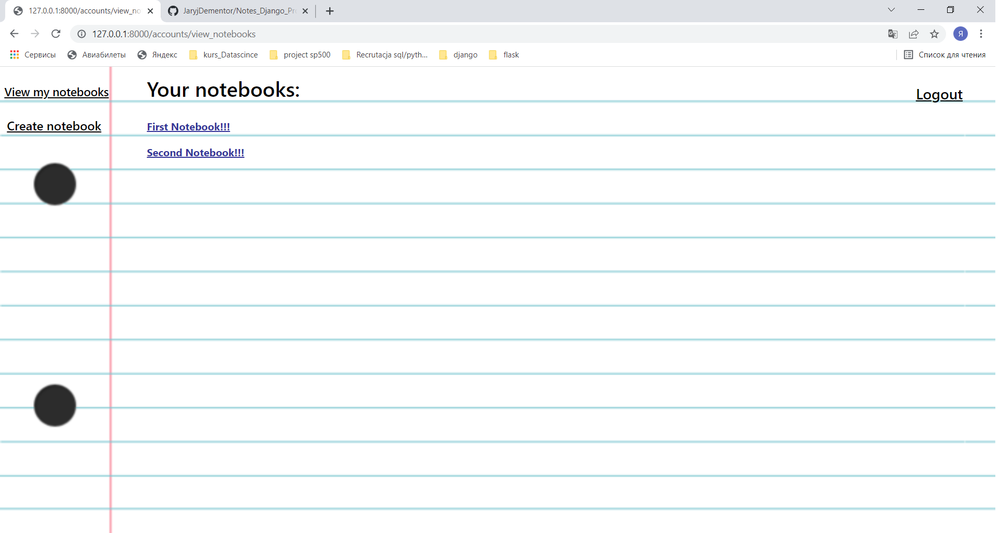
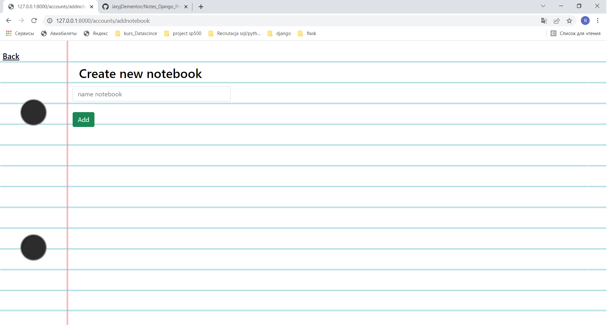
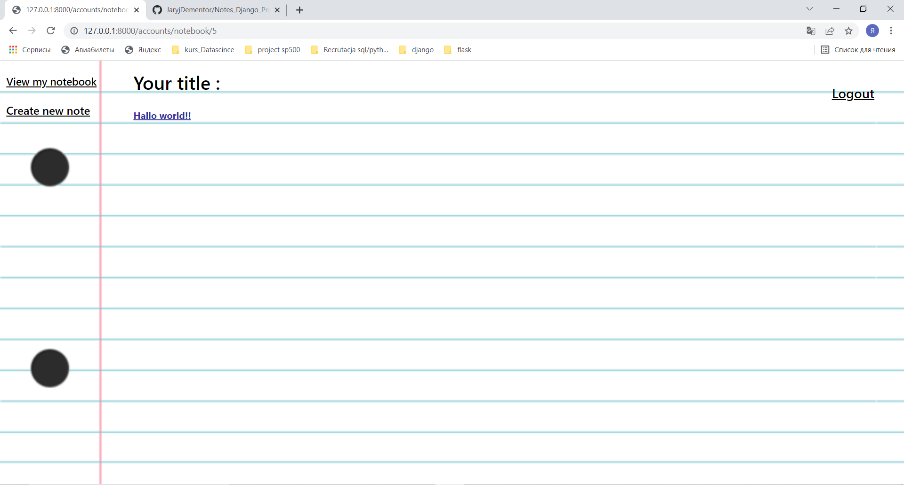
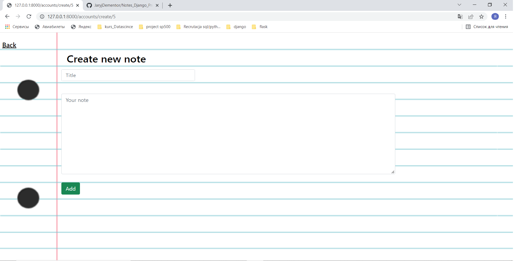
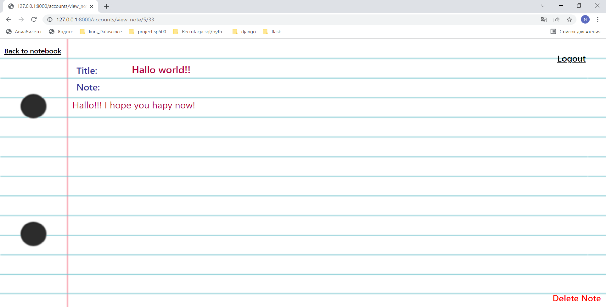

# Notes_Django_Project

# This is the Notes web application.

# Setup

### To get this repository, run the following command inside your git enabled terminal

* git clone https://github.com/JaryjDementor/Notes_Django_Project.git

### You will need django to be installed in you computer to run this app. Head over to https://www.djangoproject.com/download/ for the download guide

### Once you have downloaded django, go to the cloned repo directory and run the following command:
* python manage.py makemigrations

### his will create all the migrations file (database migrations) required to run this App.

### Now, to apply this migrations run the following command
* python manage.py migrate

### Next we need to create an admin user to run this App. On the terminal, type the following command and provide username, password and email for the admin user
* python manage.py createsuperuser

### Next need to start the server now and then we can start using App. Start the server by following command
* python manage.py runserver

## App guide
## In this application the user can:
* Register 
* log in 
* Logout 
* Create notebook
* View all notebooks
* View the selected notebook
* Create note 
* View note

## On the first page, the user can proceed to registration or logging.

## By clicking on the register link, a registration form will be made available to the user.
### The user will be asked to:
* Username
* Email
* Password

## By clicking on the register link, a logining form will be made available to the user.
### On the logging page, the user will be asked to:
* Username
* Password

### If the user has entered the wrong information, the page will be displayed and the user will be prompted to enter the username and password again.
## If the data entered is correct, the user is redirected to the record list notebooks.

### If the user navigates to the page for creating new notebook, the application will go to the record creation page.

### If the user clicks on the one of the notebooks,the app will take them to the view title notebook.

### On this page you can view the title of your entries or go to the page for creating new note.
## If the user navigates to the page for creating a new note, the application will go to the record creation page.

## If the user clicks on the title of their entry, the app will take them to the view note page

## If the user clicks on Logout, the software logs the user out and goes to the first page.

## Thank you for reading the Notes app :)

