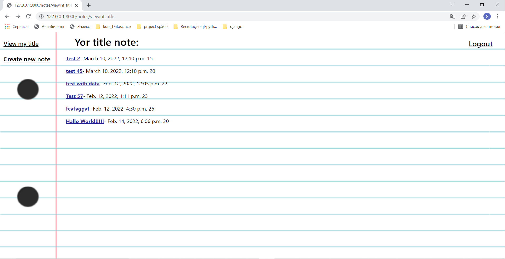
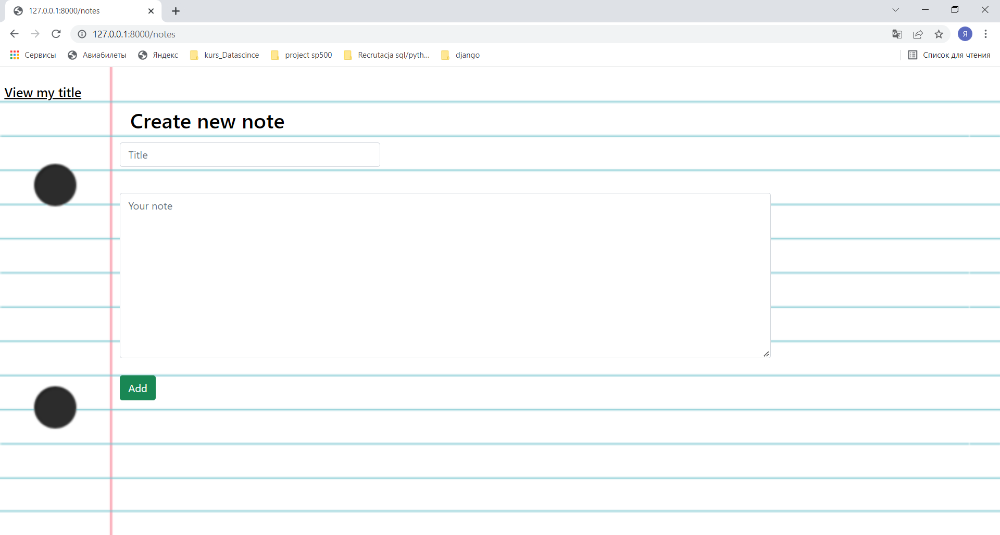
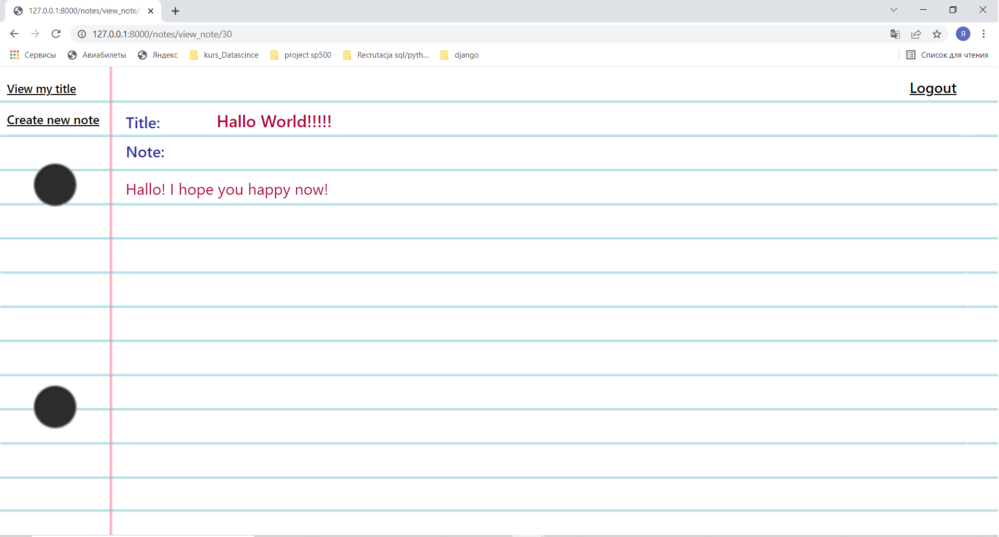

# Notes_Django_Project

# This is the Notes web application.
## In this application the user can:
* Register 
* log in 
* Logout 
* Create note 
* View note

## On the first page, the user can proceed to registration or logging.

## By clicking on the register link, a registration form will be made available to the user.
### The user will be asked to:
* Username
* Email
* Password

## By clicking on the register link, a logining form will be made available to the user.
### On the logging page, the user will be asked to:
* Username
* Password

### If the user has entered the wrong information, the page will be displayed and the user will be prompted to enter the username and password again.
## If the data entered is correct, the user is redirected to the record title page.

### On this page you can view the title of your entries or go to the page for creating new note.
## If the user navigates to the page for creating a new note, the application will go to the record creation page.

## If the user clicks on the title of their entry, the app will take them to the view note page

## If the user clicks on Logout, the software logs the user out and goes to the first page.

