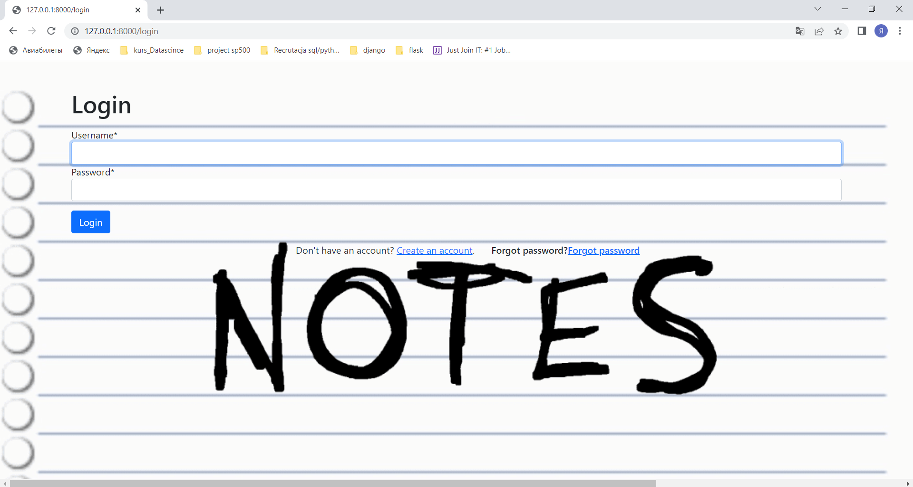

# Notes_Django_Project

# This is the Notes web application.

# Setup

### To get this repository, run the following command inside your git enabled terminal

* git clone https://github.com/JaryjDementor/Notes_Django_Project.git

### You will need django to be installed in you computer to run this app. Head over to https://www.djangoproject.com/download/ for the download guide

### Once you have downloaded django, go to the cloned repo directory and run the following command:
* python manage.py makemigrations

### his will create all the migrations file (database migrations) required to run this App.

### Now, to apply this migrations run the following command
* python manage.py migrate

### Next we need to create an admin user to run this App. On the terminal, type the following command and provide username, password and email for the admin user
* python manage.py createsuperuser

### Next need to start the server now and then we can start using App. Start the server by following command
* python manage.py runserver

## App guide
## In this application the user can:
* Register 
* log in 
* Logout 
* Reset password
* Create notebook
* View all notebooks
* View the selected notebook
* Edit name notebook
* Delete notebook
* Create note 
* View note
* Edit note
* Delete note
* Rest API

## On the first page, the user can proceed to registration or logging.

## By clicking on the register link, a registration form will be made available to the user.
### The user will be asked to:
* Username
* Email
* Password

## By clicking on the login link, a logining form will be made available to the user.
### On the logging page, the user will be asked to:
* Username
* Password

### If you forgot password, you can click "Forgot password". On this page you must enter the email to which your login is register or click 'Back'and they will return to logining.

### After you click 'Reset password' an email will come to your email with a link to which you will be able to reset password.

### By clicking on the link in the mail you get to the password change page.

### On this page you enter new password,click 'Reset password confirm' and application get logining page.

### If the user has entered the wrong information, the page will be displayed and the user will be prompted to enter the username and password again.
## If the data entered is correct, the user is redirected to the record list notebooks.

## On this page you will see a list of notebooks you have created and create new notebook.

### If the user navigates to the page for creating new notebook, the application will go to the record creation page.

### If you click select notebook< application navigate you to the notebook page.

### On this page you can create new note, edit name notebook and delete notebook.

## If the user navigates to the page for edit name notebook, the application will go to the record update name notebook.

### On this page you can change name notebook or come back to notebook.

## If you navigate to the page for creating a new note, the application will go to the record creation page.

### If you click 'Delete Notebook'.The notebook will be delete.

## If you click on the title of their entry, the app will take them to the view note page.

## On this page user can edit note or delete note. 

## If you navigate to the page for edit note, the application will go to the record update note.

### On this page you can change note or come back to view note page.
### If you click 'Delete Note',the note will be delete.   

## If the user clicks on Logout, the software logs the user out and goes to the first page.

## REST API
### If the user is logged in as an administrator, the REST API will be available.

### If admin clicks on "View all users", the application will go to the Django Rest Api.

### On this page, the admin can view all registered users and crate new user. 

### If the admin enters the user ID in the url, the page for editing this user's data will open.

## Thank you for reading the Notes app :)

